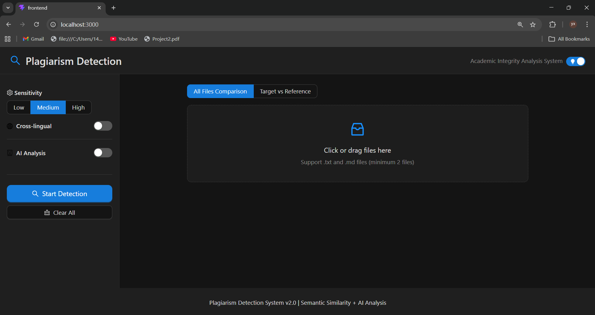
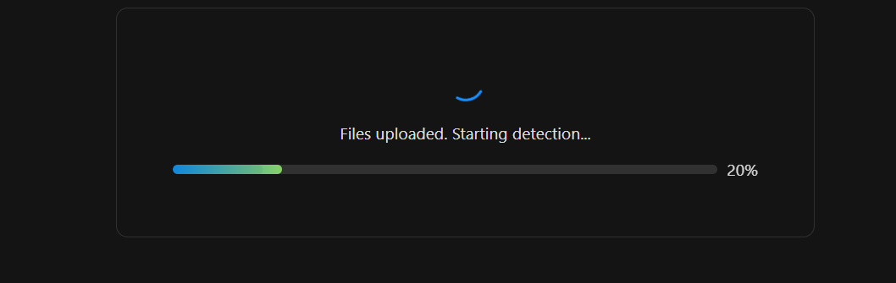

# Academic Plagiarism Detection System | 学术查重检测系统

[English](#english) | [中文](#中文)

---

<a id="english"></a>

## English

### Overview

An academic plagiarism detection system that combines **vector similarity search** (Sentence Transformers + FAISS) with **LLM-powered deep analysis** (DeepSeek). Supports Chinese and English text with cross-lingual detection. Built with a modern **React + FastAPI** architecture.

### Quick Start

```bash
# Backend
pip install -r requirements.txt
pip install fastapi uvicorn python-multipart
python -m uvicorn backend.main:app --reload --port 8000

# Frontend (separate terminal)
cd frontend && npm install && npm run dev
```

Open http://localhost:3000. Upload `.txt` or `.md` files and click **Start Detection**.

For AI features, create `api_config.json` in the project root:

```json
{
  "modelscope": {
    "base_url": "https://api.deepseek.com/v1",
    "api_key": "your-api-key",
    "model": "deepseek-chat"
  }
}
```

Or set environment variables: `MODELSCOPE_API_KEY`, `MODELSCOPE_BASE_URL`, `MODELSCOPE_MODEL`.

---

### Detection Pipeline

The system runs a 3-stage cascade:

```
Stage 1 (always)            Stage 2 (AI on)              Stage 3 (AI on)
┌──────────────────┐    ┌───────────────────────┐    ┌────────────────────────┐
│ Text Preprocessing│    │ LLM Citation Refinement│    │ Agent Deep Analysis    │
│ Embedding (cached)│───>│                       │───>│                        │
│ FAISS Search      │    │ Replace rule-based     │    │ Prosecutor perspective  │
│ Pair Detection    │    │ penalties with LLM     │    │ Defense perspective     │
│ Citation Penalty  │    │ assessed penalties     │    │ Confidence calibration  │
│ Paragraph Detect  │    │                       │    │                        │
└──────────────────┘    └───────────────────────┘    └────────────────────────┘
```

#### Stage 1: Base Detection

**Text Preprocessing:**
- Auto-detects language per sentence via `langdetect` (ISO 639-1 codes)
- Splits text into sentences using language-aware boundaries:
  - Chinese: `。！？；`
  - English: `.!?;` with abbreviation handling (Mr, Dr, e.g., i.e., U.S., etc.)
- Sentences shorter than 5 characters are filtered out
- Paragraphs split by blank lines; paragraphs with < 2 sentences or < 20 characters are skipped

**Embedding & Indexing:**
- Model: `all-MiniLM-L6-v2` (384-dimensional vectors)
- Cross-lingual mode: `paraphrase-multilingual-MiniLM-L12-v2`
- Index: FAISS `IndexFlatIP` (inner product = cosine similarity on normalized vectors)
- Caching: Content-hash-based `.npy` files in `.cache/embeddings/`

**Similarity Detection:**

The system performs **directional pairing** — each sentence searches for similar sentences in other documents:

```
For each sentence i in document A:
    Search FAISS index for top-k most similar sentences
    For each match j with similarity >= threshold:
        Record pair (A -> B, similarity)
```

Default thresholds:
| Level | Sentence | Paragraph | Cross-lingual |
|-------|----------|-----------|---------------|
| Low   | 0.70     | 0.63      | 0.65          |
| Medium| 0.82     | 0.75      | 0.65          |
| High  | 0.90     | 0.83      | 0.65          |

**Scoring Formula:**

The composite plagiarism risk score combines four factors:

```
Score = 0.40 x mean_sim + 0.35 x coverage_min + 0.15 x max_sim + 0.10 x hit_ratio
```

Where:
- `mean_sim` — Average cosine similarity across all matched sentence pairs
- `coverage_min` — min(coverage_A, coverage_B), the fraction of each document's sentences involved in matches
- `max_sim` — Highest single-pair similarity
- `hit_ratio` — Number of matches normalized by max (50), capped at 1.0

For paragraph-level analysis, a slightly different weighting is used:

```
Para_Score = 0.45 x mean_sim + 0.35 x coverage_min + 0.20 x max_sim
```

#### Stage 2: Rule-Based Citation Penalty

Applied to every matched sentence pair during Stage 1. The penalty coefficient adjusts the similarity score:

```
adjusted_sim = original_sim x penalty
```

Penalty hierarchy (lower = stronger citation defense):

| Condition | Penalty | Example |
|-----------|---------|---------|
| Explicit source citation + quotation marks | 0.40 | "According to Smith (2020), 'AI transforms education'" |
| Explicit source citation (no quotes) | 0.60 | According to Smith (2020), AI transforms education |
| Both sides have citation markers | 0.60 | Both texts contain [1] or (Author, Year) |
| Quotation marks only (no source) | 0.75 | "AI transforms education" |
| Citation marker only | 0.85 | According to [1]... |
| No citation markers | 1.00 | No adjustment |

Source-specific detection: the system extracts candidate terms (capitalized English words, Chinese phrases, years) from the reference document, then checks if they appear within +-50 characters of a citation marker in the target text.

#### Stage 2 (AI): LLM Citation Refinement

When AI is enabled, the `CitationAnalyzer` replaces rule-based penalties with LLM-assessed penalties for hits that have citation markers (hits without markers are skipped — fast path).

The LLM evaluates each hit and returns a `CitationAssessment`:

| Field | Values | Description |
|-------|--------|-------------|
| `is_properly_cited` | true/false | Whether the citation is academically proper |
| `citation_quality` | 0.0-1.0 | Quality score of the citation |
| `paraphrase_level` | verbatim / paraphrase / digest | Level of text transformation |
| `is_common_knowledge` | true/false | Whether the content is common knowledge |
| `adjusted_penalty` | 0.0-1.0 | Replacement penalty coefficient |
| `explanation` | text | LLM's reasoning |

The LLM receives: target sentence, reference sentence, surrounding context (+-1 sentence), detected citation markers, and raw similarity score.

#### Stage 3: AI Agent Deep Analysis

When AI is enabled, the `SmartPlagiarismAgent` performs document-level analysis on high-risk pairs (score >= 0.40).

**Evidence Sampling:** From all matched pairs, 5 representative samples are selected:
- 1 highest-similarity pair
- 2 medium-similarity pairs (from the middle third)
- 2 positionally dispersed pairs (earliest + latest in document)

**Dual-Phase Analysis:**

| Phase | Role | Output |
|-------|------|--------|
| Prosecutor | Argues why this IS plagiarism | `is_plagiarism`, `confidence`, `reasoning`, `key_evidence` |
| Defense | Argues why this might NOT be plagiarism | `defense_points`, `weakness`, `alternative_explanation` |

Defense is optional (Quick mode = prosecutor only; Thorough mode = both phases).

**Confidence Calibration:**

The raw LLM confidence is adjusted by three factors:

```
final_confidence = raw_confidence x defense_adjustment x stat_adjustment x citation_adjustment
```

1. **Defense adjustment:** Each defense point reduces confidence by 10%, up to 30% total
2. **Statistical adjustment:** If coverage > 80% and mean_sim > 90%, confidence boosted by up to 20% (capped at 95%)
3. **Citation adjustment:** If average citation penalty < 0.5 (strong citations), confidence reduced by 30% and `is_plagiarism` set to false

---

### Feature List

| Feature | Description |
|---------|-------------|
| **File Upload** | Drag-and-drop upload of `.txt`/`.md` files |
| **Detection Modes** | All-files mutual comparison or target-vs-reference |
| **Sensitivity Levels** | Low (0.70) / Medium (0.82) / High (0.90) |
| **Sentence Detection** | Granular sentence-by-sentence similarity matching |
| **Paragraph Detection** | Coarser paragraph-level comparison |
| **Cross-lingual Detection** | Auto-enabled when files in different languages are detected; uses multilingual model with lower threshold (0.65) |
| **Citation Recognition** | Rule-based detection of `[1]`, `(Author, Year)`, `根据...`, `引用...` and other patterns |
| **AI Citation Analysis** | LLM assesses citation quality, paraphrase level, common knowledge |
| **AI Agent Analysis** | Dual-perspective (prosecutor/defense) deep analysis with confidence calibration |
| **Dark Mode** | Toggle dark/light theme in header |
| **Report Export** | CSV, JSON, Word (.docx) — 7 formats total |
| **Auto-retry** | If no matches at current threshold, automatically lowers by 0.10 |
| **Real-time Progress** | Progress bar during detection |
| **Side-by-side Comparison** | Highlighted text comparison with similarity color coding |

### Screenshots

**Main Interface:**



**Detection Results:**



**Full Results Page:** See [result.html](result.html) for an interactive view of the detection results.

---

### Tech Stack

- **Frontend:** React 19 + Vite 8 + Ant Design 6
- **Backend:** Python + FastAPI + Uvicorn
- **Detection Engine:** Sentence Transformers + FAISS + NumPy
- **LLM Integration:** DeepSeek via OpenAI-compatible API
- **Language Detection:** langdetect

### Project Structure

```
backend/                 # FastAPI backend
├── main.py             # API routes (upload, detect, results, export)
├── runner.py           # 3-stage unified detection pipeline
└── schemas.py          # Pydantic request/response models

frontend/src/            # React frontend
├── api/index.js        # Axios API client
├── components/         # UI components
└── App.jsx             # Main layout with dark mode

plagiarism_checker/      # Core detection engine
├── pipeline.py         # Pipeline orchestrator & config
├── corpus.py           # Text loading, sentence/paragraph splitting
├── embedder.py         # Embedding + FAISS indexing + caching
├── similarity.py       # Pair detection, aggregation, scoring
├── citation.py         # Rule-based citation penalty
├── citation_analyzer.py# LLM citation assessment
├── agent.py            # AI dual-perspective analysis
├── crosslingual.py     # Cross-language detection
├── reporting.py        # Multi-format report generation
└── cli.py              # Standalone CLI

dataset/                 # Sample input files (A.txt-D.txt)
tests/                   # Test suite
```

### Testing

```bash
python -m pytest tests/ -v
python -m pytest tests/test_corpus.py -v
```

---

<a id="中文"></a>

## 中文

### 概述

学术查重检测系统，结合**向量相似度检索**（Sentence Transformers + FAISS）与**大语言模型深度分析**（DeepSeek），支持中英文文本及跨语言检测。采用 **React + FastAPI** 前后端分离架构。

### 快速开始

```bash
# 后端
pip install -r requirements.txt
pip install fastapi uvicorn python-multipart
python -m uvicorn backend.main:app --reload --port 8000

# 前端（另开终端）
cd frontend && npm install && npm run dev
```

浏览器打开 http://localhost:3000，上传 `.txt` 或 `.md` 文件，点击 **Start Detection** 即可。

如需使用 AI 功能，在项目根目录创建 `api_config.json`：

```json
{
  "modelscope": {
    "base_url": "https://api.deepseek.com/v1",
    "api_key": "你的API密钥",
    "model": "deepseek-chat"
  }
}
```

也可通过环境变量配置：`MODELSCOPE_API_KEY`、`MODELSCOPE_BASE_URL`、`MODELSCOPE_MODEL`。

---

### 检测流水线

系统采用三阶段级联检测：

```
阶段1（始终执行）            阶段2（开启AI时）           阶段3（开启AI时）
┌──────────────────┐    ┌───────────────────────┐    ┌────────────────────────┐
│ 文本预处理         │    │ LLM 引用精化            │    │ Agent 深度分析          │
│ 向量化（带缓存）    │───>│                       │───>│                        │
│ FAISS 相似检索     │    │ 用 LLM 评估结果替代     │    │ 检察官视角（指控抄袭）    │
│ 配对检测           │    │ 规则引擎的粗略惩罚       │    │ 辩护律师视角（寻找无罪）  │
│ 引用惩罚           │    │                       │    │ 置信度校准               │
│ 段落级检测         │    │                       │    │                        │
└──────────────────┘    └───────────────────────┘    └────────────────────────┘
```

#### 阶段1：基础检测

**文本预处理：**
- 通过 `langdetect` 自动检测每个句子的语言（ISO 639-1 编码）
- 基于语言感知的边界进行分句：
  - 中文：`。！？；`
  - 英文：`.!?;`，并处理缩写（Mr、Dr、e.g.、i.e.、U.S. 等）
- 长度 < 5 个字符的句子被过滤
- 段落按空行分割；< 2 个句子或 < 20 个字符的段落被跳过

**向量嵌入与索引：**
- 模型：`all-MiniLM-L6-v2`（384维向量）
- 跨语言模式：`paraphrase-multilingual-MiniLM-L12-v2`
- 索引：FAISS `IndexFlatIP`（内积 = 归一化向量的余弦相似度）
- 缓存：基于内容哈希的 `.npy` 文件，存储在 `.cache/embeddings/`

**相似度检测：**

系统执行**方向性配对** — 每个句子在其他文档中搜索相似句子：

```
对于文档A中的每个句子 i：
    在 FAISS 索引中搜索 top-k 个最相似的句子
    对于每个相似度 >= 阈值的匹配 j：
        记录配对 (A -> B, 相似度)
```

默认阈值：

| 灵敏度 | 句子阈值 | 段落阈值 | 跨语言阈值 |
|--------|----------|----------|------------|
| Low    | 0.70     | 0.63     | 0.65       |
| Medium | 0.82     | 0.75     | 0.65       |
| High   | 0.90     | 0.83     | 0.65       |

**评分公式：**

综合抄袭风险得分由四个因素加权计算：

```
Score = 0.40 x mean_sim + 0.35 x coverage_min + 0.15 x max_sim + 0.10 x hit_ratio
```

其中：
- `mean_sim` — 所有匹配句子对的平均余弦相似度
- `coverage_min` — min(覆盖率_A, 覆盖率_B)，即每篇文档参与匹配的句子比例（取较小值，保守估计）
- `max_sim` — 最高单对相似度
- `hit_ratio` — 匹配数量按上限(50)归一化，封顶1.0

段落级分析使用略有不同的权重：

```
Para_Score = 0.45 x mean_sim + 0.35 x coverage_min + 0.20 x max_sim
```

#### 阶段2（规则）：基于规则的引用惩罚

在阶段1期间，对每个匹配的句子对应用引用惩罚系数，调整相似度得分：

```
adjusted_sim = original_sim x penalty
```

惩罚层级（越低 = 引用辩护越强）：

| 条件 | 惩罚系数 | 示例 |
|------|----------|------|
| 明确引用了参考来源 + 有引号 | 0.40 | "根据 Smith (2020)，'AI 改变了教育'" |
| 明确引用了参考来源（无引号） | 0.60 | 根据 Smith (2020)，AI 改变了教育 |
| 双方都有引用标记 | 0.60 | 两段文本都包含 [1] 或（作者，年份） |
| 仅有引号（无来源） | 0.75 | "AI 改变了教育" |
| 仅有引用标记 | 0.85 | 根据 [1]... |
| 无任何引用标记 | 1.00 | 不调整 |

来源特定检测：系统从参考文档中提取候选词（大写英文单词、中文词组、年份），然后检查它们是否出现在目标文本中引用标记的 +-50 个字符范围内。

#### 阶段2（AI）：LLM 引用精化

开启 AI 后，`CitationAnalyzer` 对含有引用标记的匹配对使用 LLM 重新评估惩罚（无标记的匹配对直接跳过，走快速路径）。

LLM 评估每个匹配对并返回 `CitationAssessment`：

| 字段 | 取值 | 说明 |
|------|------|------|
| `is_properly_cited` | true/false | 引用是否学术规范 |
| `citation_quality` | 0.0-1.0 | 引用质量评分 |
| `paraphrase_level` | verbatim / paraphrase / digest | 文本改写程度 |
| `is_common_knowledge` | true/false | 内容是否属于常识 |
| `adjusted_penalty` | 0.0-1.0 | 替代惩罚系数 |
| `explanation` | 文本 | LLM 的判断理由 |

LLM 接收的输入：目标句子、参考句子、上下文（前后各1句）、检测到的引用标记、原始相似度。

#### 阶段3：AI Agent 深度分析

开启 AI 后，`SmartPlagiarismAgent` 对高风险配对（得分 >= 0.40）执行文档级分析。

**证据采样：** 从所有匹配对中选取5个代表性样本：
- 1个最高相似度对
- 2个中等相似度对（来自中间三分之一区间）
- 2个位置分散对（文档中最早 + 最晚出现）

**双视角分析：**

| 阶段 | 角色 | 输出 |
|------|------|------|
| 检察官 | 论证为什么是抄袭 | `is_plagiarism`、`confidence`、`reasoning`、`key_evidence` |
| 辩护律师 | 论证为什么可能不是抄袭 | `defense_points`、`weakness`、`alternative_explanation` |

辩护阶段可选（Quick 模式 = 仅检察官；Thorough 模式 = 双阶段）。

**置信度校准：**

LLM 原始置信度经三个因素调整：

```
final_confidence = raw_confidence x 辩护调整 x 统计调整 x 引用调整
```

1. **辩护调整：** 每个辩护论点降低10%置信度，最多降30%
2. **统计调整：** 若覆盖率 > 80% 且平均相似度 > 90%，置信度提升最高20%（封顶95%）
3. **引用调整：** 若平均引用惩罚 < 0.5（引用充分），置信度降低30%，且 `is_plagiarism` 设为 false

---

### 功能列表

| 功能 | 说明 |
|------|------|
| **文件上传** | 拖拽上传 `.txt`/`.md` 文件 |
| **检测模式** | 全部文件互比 或 目标文件 vs 参考文件 |
| **灵敏度** | 低(0.70) / 中(0.82) / 高(0.90) 三档 |
| **句子级检测** | 逐句相似度匹配 |
| **段落级检测** | 更粗粒度的段落对比 |
| **跨语言检测** | 检测到文件语言不同时自动开启，使用多语言模型 + 较低阈值(0.65) |
| **引用识别** | 规则检测 `[1]`、`(Author, Year)`、`根据...`、`引用...` 等模式 |
| **AI 引用分析** | LLM 评估引用质量、改写程度、是否常识 |
| **AI Agent 分析** | 检察官/辩护律师双视角深度分析，带置信度校准 |
| **夜间模式** | Header 右上角切换暗色/亮色主题 |
| **报告导出** | CSV、JSON、Word(.docx) 共7种格式 |
| **自动重试** | 当前阈值无匹配时，自动降低0.10重试 |
| **进度显示** | 检测过程中显示进度条 |
| **文本对比** | 并排高亮显示，按相似度分级着色 |

### 系统截图

**主界面：**


**检测结果：**


**完整结果页面：** 参见 [result.html](result.html)，可查看检测结果的交互式页面。

---

### 技术栈

- **前端：** React 19 + Vite 8 + Ant Design 6
- **后端：** Python + FastAPI + Uvicorn
- **检测引擎：** Sentence Transformers + FAISS + NumPy
- **大语言模型：** DeepSeek（OpenAI 兼容 API）
- **语言检测：** langdetect

### 项目结构

```
backend/                 # FastAPI 后端
├── main.py             # API 路由（上传、检测、结果、导出）
├── runner.py           # 三阶段统一检测流水线
└── schemas.py          # Pydantic 请求/响应模型

frontend/src/            # React 前端
├── api/index.js        # Axios API 客户端
├── components/         # UI 组件
└── App.jsx             # 主布局（含夜间模式）

plagiarism_checker/      # 核心检测引擎
├── pipeline.py         # 流水线编排与配置
├── corpus.py           # 文本加载、句子/段落分割
├── embedder.py         # 向量嵌入 + FAISS 索引 + 缓存
├── similarity.py       # 配对检测、聚合、评分
├── citation.py         # 基于规则的引用惩罚
├── citation_analyzer.py# LLM 引用评估
├── agent.py            # AI 双视角分析
├── crosslingual.py     # 跨语言检测
├── reporting.py        # 多格式报告生成
└── cli.py              # 独立命令行工具

dataset/                 # 示例输入文件（A.txt-D.txt）
tests/                   # 测试套件
```

### 测试

```bash
python -m pytest tests/ -v
python -m pytest tests/test_corpus.py -v
```
